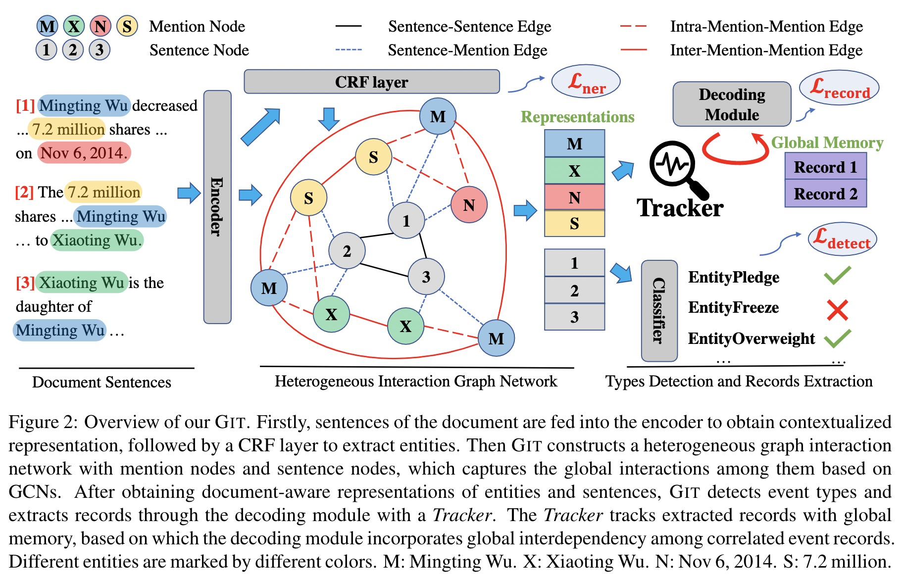
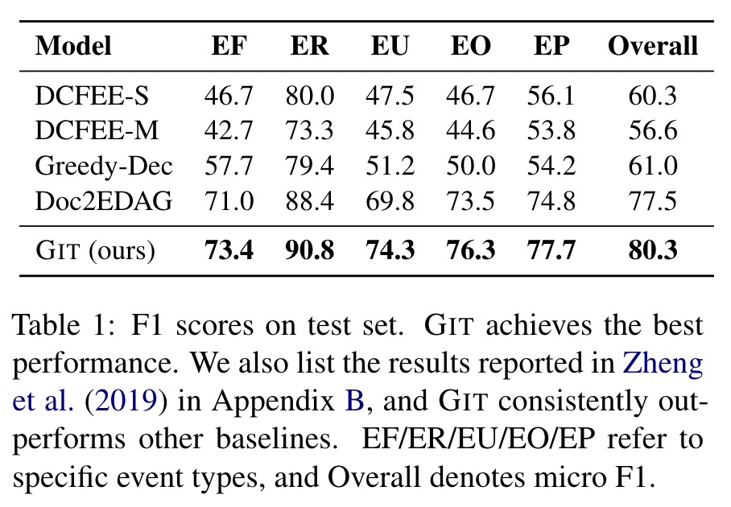

# Document-level Event Extraction via Heterogeneous Graph-based Interaction Model with a Tracker

Source code for ACL-IJCNLP 2021 Long paper: [Document-level Event Extraction via Heterogeneous Graph-based Interaction Model with a Tracker](https://arxiv.org/abs/2105.14924).

Our code is based on [Doc2EDAG](https://github.com/dolphin-zs/Doc2EDAG).


## 0. Introduction

> Document-level event extraction aims to extract events within a document. Different from sentence-level event extraction, the arguments of an event record may scatter across sentences, which requires a comprehensive understanding of the cross-sentence context. Besides, a document may express several correlated events simultaneously, and recognizing the interdependency among them is fundamental to successful extraction. To tackle the aforementioned two challenges, We propose a novel heterogeneous Graph-based Interaction Model with a Tracker (GIT). A graph-based interaction network is introduced to capture the global context for the scattered event arguments across sentences with different heterogeneous edges. We also decode event records with a Tracker module, which tracks the extracted event records, so that the interdependency among events is taken into consideration. Our approach delivers better results over the state-of-the-art methods, especially in cross-sentence events and multiple events scenarios.


+ Architecture


+ Overall Results
<!--  -->
<div align=center></div>

## 1. Package Description
```
GIT/
├─ dee/
    ├── __init__.py
    ├── base_task.py
    ├── dee_task.py
    ├── ner_task.py
    ├── dee_helper.py: data features constrcution and evaluation utils
    ├── dee_metric.py: data evaluation utils
    ├── config.py: process command arguments
    ├── dee_model.py: GIT model
    ├── ner_model.py
    ├── transformer.py: transformer module
    ├── utils.py: utils
├─ run_dee_task.py: the main entry
├─ train_multi.sh
├─ run_train.sh: script for training (including evaluation)
├─ run_eval.sh: script for evaluation
├─ Exps/: experiment outputs
├─ Data.zip
├─ Data: unzip Data.zip
├─ LICENSE
├─ README.md
```

## 2. Environments

- python         (3.6.9)
- cuda           (11.1)
- Ubuntu-18.0.4  (5.4.0-73-generic)

## 3. Dependencies

- numpy          (1.19.5)
- torch          (1.8.1+cu111)
- pytorch-pretrained-bert   (0.4.0)
- dgl-cu111      (0.6.1)
- tensorboardX   (2.2)

PS: The environments and dependencies listed here is different from what we use in our paper, so the results may be a bit different.

## 4. Preparation

- Unzip Data.zip and you can get an Data folder, where the training/dev/test data locate.

## 5. Training

```bash
>> bash run_train.sh
```

## 6. Evaluation

```bash
>> bash run_eval.sh
```

(The evaluation is also conducted after the training)

## 7. License

This project is licensed under the MIT License - see the [LICENSE](LICENSE) file for details.

## 8. Citation

If you use this work or code, please kindly cite the following paper:

```bib
@inproceedings{xu-etal-2021-git,
    title = "Document-level Event Extraction via Heterogeneous Graph-based Interaction Model with a Tracker",
    author = "Runxin Xu  and
      Tianyu Liu  and
      Lei Li and
      Baobao Chang",
    booktitle = "The Joint Conference of the 59th Annual Meeting of the Association for Computational Linguistics and the 11th International Joint Conference on Natural Language Processing (ACL-IJCNLP 2021)",
    year = "2021",
    publisher = "Association for Computational Linguistics",
}
```
